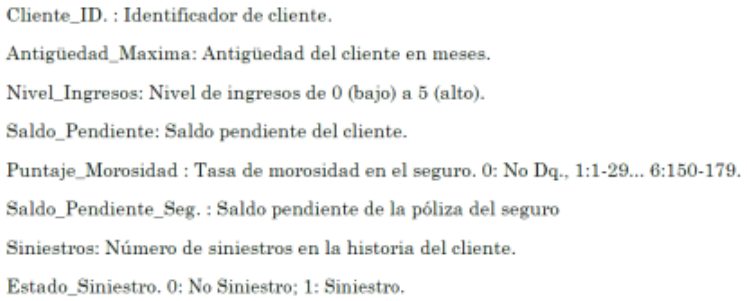

# PROGRAMA ESPECIALIZADO CIENCIA DE DATOS CON PYTHON

> _Parte 2:_ ESTADÍSTICA PARA CIENCIA DE DATOS CON PYTHON

## Proyecto 4:

Instructor: Msc (e) Ing. Est. E Inf. Yaneth Ccahuantico Mendoza

> Entrega: Sabado 20 de mayo del 2023

### Entregable

- Se tiene un conjunto de datos simulado basado en seis meses de la información recogida por una aseguradora mundial llamada “SALUD Y SEGUROS”, cuyo objetivo fue desarrollar un modelo para determinar la probabilidad de siniestro en los próximos 12 meses.
- La variable de interés es la siniestralidad , que representa el estado binario de No Siniestro 0 y Siniestro 1.

#### Descripción del problema:

Los modelos analíticos para el manejo de los seguros de accidentes se están usando por muchas instituciones y están dando resultados exitosos en todo el mundo. Los modelos analíticos se pueden definir como un conjunto de métodos y técnicas cuantitativas usados para predecir la probabilidad de que un cliente falle (sea siniestros) y en consecuencia no se recupere el crédito otorgado por la empresa.

#### Descripción de las variables

#### Desarrollar el modelo basado en la metodología CRISP-DM.

- Realizar el análisis exploratorio de datos (EDA) con la variable dependiente (Target) e interpretar los hallazgos.
- Identificar las variables más importantes
- 1. Realizar análisis exploratorio de datos
- 2. Realizar la segmentación de clientes (creando la variable cualitativa de segmentación).
- 3. Desarrollar 1 modelo incluyendo la variable de segmentación como variable cualitativa o desarrollar 1 modelo dentro de cada segmento.
- Interpretaciòn, conclusiones y recomendaciones

### Recursos

<a href="https://github.com/LexAguirre/Course_Data_and_analytics/blob/main/Proyecto_4/Proyecto_4.ipynb">Proyecto 4 Análisis Exploratorio de datos

<a href="https://youtu.be/8LizN5jgvu4">Explicación del proyecto 4</a>
